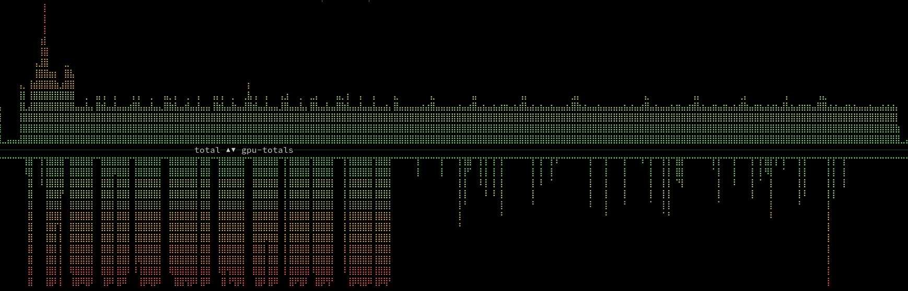
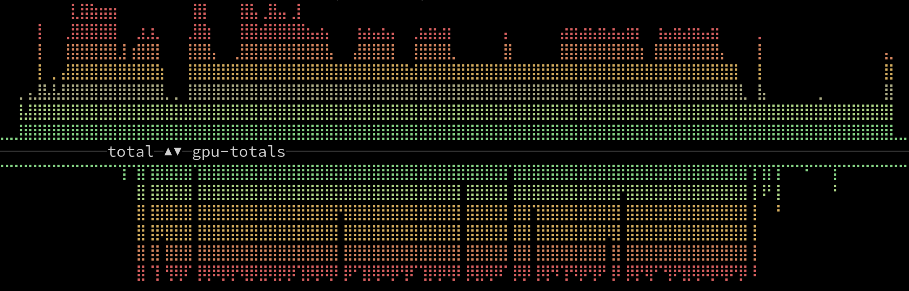

# Whisperx Batch

> [!WARNING]
> Consider this to be more of a proof-of-concept than a production-ready implementation!

---

This project leverages [Ray](https://www.ray.io/) for better batch processing of multiple audio files using [WhisperX](https://github.com/m-bain/whisperX).

**Main Features:**

- Avoid loading and resampling the same audio file multiple times
- Make use of pipelining to increase throughput and resource utilization
- Write output files as they become available dynamically and not just at the very end of execution
- Good observability and plenty of configuration options by delegating the scheduling to Ray


The pipeline is divided into these stages:

- Load audio
- Transcribe ("TranscriptionActor")
- (optional) Align ("AlignmentActor")
- (optional) Diarize ("DiarizationActor")

You can see the current progress in the Dashboard ([http://localhost:8265/](http://localhost:8265/)).

## Basic Usage

**Notes:** 

- Use absolute paths for any argument that references a file or folder as it might be that the execution environment is changed by Ray
- `--batch_file` and `--language` are required options
- Adjust resource params ("num_gpus", "num_cpus") and actor sizes for your environment. You might need to experiment a bit to achieve the best combination for optimal resource utilization and to prevent backpressure from happening
- The batch file must contain one valid audio file path per line
- Original whisperX params should work the same, but it was not verified for all options. Diarization was not tested yet, for example.

```bash
git clone git@github.com:olastor/whisperx-batch.git
cd whisperx-batch/
uv sync
export TORCH_FORCE_NO_WEIGHTS_ONLY_LOAD=true # see https://github.com/m-bain/whisperX/issues/1304

# Example execution on a single node with 4 CPU cores and a GPU with 16GB of vRAM (no diarization)
uv run whisperx-batch \
  --model large-v3 \
  --language en \
  --batch_size 16 \
  --output_dir /path/to/output \
  --batch_file /path/to/batchfile \
  --load_audio_num_tasks 2 \
  --load_audio_num_cpus 0.3 \
  --transcribe_actor_size 1 \
  --transcribe_num_gpus 0.4 \
  --transcribe_num_cpus 1 \
  --align_actor_size 2 \
  --align_num_gpus 0.3 \
  --align_num_cpus 1
```

## Performance Comparison (in one case)

The implementation of [WhisperX](https://github.com/m-bain/whisperX) does not seem to be optimized for multi-file batch-processing. This may have been out of scope for the project or not a priority, but I needed a solution for using it efficiently for many files. Here's the CPU and GPU utilization for transcribing 10 example audio files at once (without diarization):



```bash
uvx whisperx --model large-v3 --language en --batch_size 32 --output_dir /path/to/output --verbose False $(cat batch.txt)
```

You can clearly see the sequential execution of transcription and alignment by looking at the GPU metrics (bottom). First, all files are passed through the VAD+ASR models and after that there is the phase of forced alignment which has significantly lower GPU usage. This does have some benefits in a single-GPU, resource-constraint environment: Since the phases are separate, they do not load the model into the GPU's memory simultaneously, leaving more vRAM available for increasing throughput in the transcription step by increasing the `--batch_size` parameter. However, the apparent drawbacks are that the GPU is not used much for a big chunk of the total execution time (it should be mentioned that the used CPU is on the lower end and the graph might look different on other machines) and in case of errors, all transcriptions are gone because they are written to disk only at the very end of script execution. The advantage of a greater batch size seems to diminish quickly as the number of input files grow. Moreover, notice the small gaps that happen on the left side of the GPU stats (the transcription step). This is most likely happening because of the blocking operation for loading and resampling an audio file. During this time, the GPU is not used at all. Also, the same loading and resampling step will be repeated for the same file in the alignment step because it is not being buffered [if more than one file is passed as an argument](https://github.com/m-bain/whisperX/blob/d32ec3e3012ec4c0934f4088424c32f3f038b249/whisperx/transcribe.py#L174). This is good for keeping memory usage low, but bad for performance.

The implementation in this repo with Ray divides the execution also into separate steps, but they are now being defined as an [Actor](https://docs.ray.io/en/latest/ray-core/actors.html) and the initial loading is also executed as an initial [Task](https://github.com/olastor/whisperx-batch/blob/d7ca7eb1fe137e4cddeafffc8b4bd3c257200689/src/whisperx_batch/batch.py#L174). Each actor loads the required model into the GPU memory when initialized and keeps it there until the last work item was processed by it. This means there is less vRAM left (in a single-GPU setup at least) for increasing the `--batch_size` as much as before, but you get the benefits of Ray's sophisticated pipelining and scheduling logic and could also scale it to a cluster of nodes or GPUs. Looking at the resource graph on the same machine for the same audio files, the GPU usage is consistently high. The overall execution time is down by about 45% (from 11m13.763s to 6m11.737s).



```bash
uv run whisperx-batch --model large-v3 --language en --batch_size 16 --output_dir /path/to/output --batch_file ./batch.txt --load_audio_num_tasks 2 --load_audio_num_cpus 0.3 --transcribe_actor_size 1 --transcribe_num_gpus 0.4 --transcribe_num_cpus 1 --align_actor_size 2 --align_num_gpus 0.3 --align_num_cpus 1
```

One thing to watch out though is to find a good configuration to avoid backpressure. This varies depending on the resources available. The alignment consumes less memory than the transcription, but can become a bottleneck. I found that in my case (GPU with 16GB vRAM) having two alignment actors and one transcription actor seems to avoid backpressure better compared to having one transcription actor (with a higher `--batch_size` than before) and one alignemnt actor. But it also depends on other factors like the size of audio files, available CPU etc. Experimenting with the actor sizes and resource options is likely required to find a stable setting, especially when the number of input files is high.

Possible future improvements:

- Consider splitting stages further where it makes sense (requires some more complicated rewriting)
- Load audio as a tensor directly into the GPU in the beginnnig and reuse it in each stage instead of storing it the object that's passed through the pipeline

## LICENSE

- The original whisperx CLI arguments as well as parts of the code in `batch.py` for initializing/configuring the models were copied from WhisperX and are licensed under [BSD 2-Clause License](https://github.com/m-bain/whisperX/blob/main/LICENSE)
- The new code added shall also be licensed under BSD 2-Clause License.
